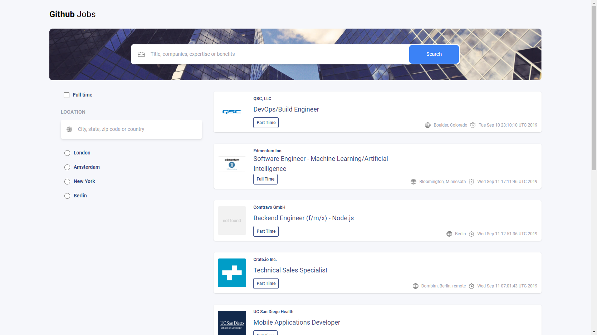
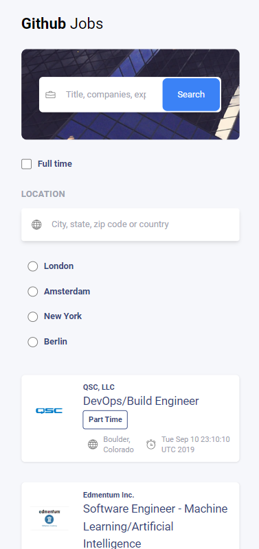
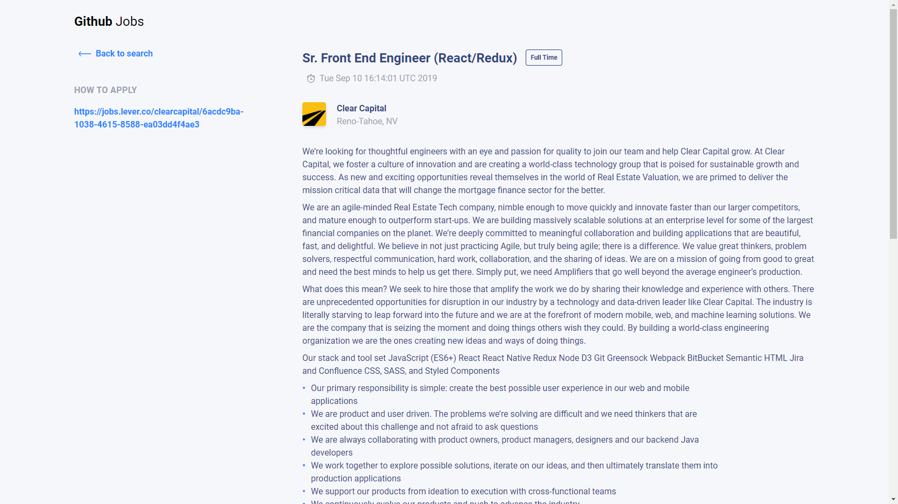

# Job search app

Solution for [Github Jobs - devchallenges](https://devchallenges.io/challenges/TtUjDt19eIHxNQ4n5jps)

## Live 📍

[https://github-jobs-search-app.netlify.app/](https://github-jobs-search-app.netlify.app/)

## Screenshots 📸

<p align="center">
    
</p>

<p align="center">
    
</p>

<p align="center">
    
</p>

## Technologies 🔧

- Vue.js
- Javascript
- Tailwind
- Vite
- Prettier
- Eslint

## Project Setup

```sh
npm install
```

### Compile and Hot-Reload for Development

```sh
npm run dev
```

### Compile and Minify for Production

```sh
npm run build
```

### Lint with [ESLint](https://eslint.org/)
